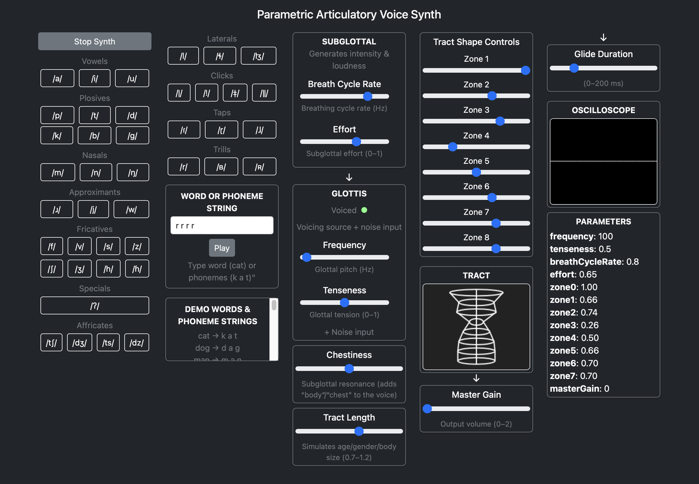
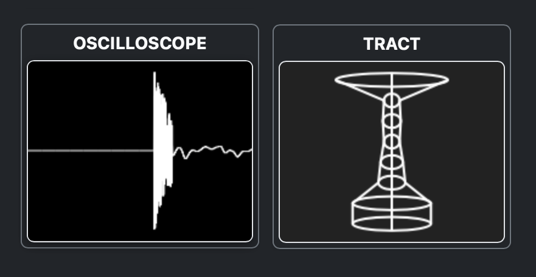
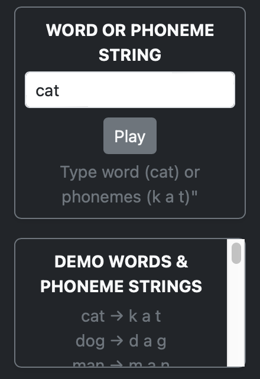

# CrowCrow: Parametric Articulatory Voice Synth (Experimental)

[](public/screenshots/ui-overview.png)
*CrowCrow main UI (click to enlarge)*

---

**CrowCrow** is an experimental, browser-based parametric articulatory speech synthesizer.  
This repo is not under active development, but is preserved as an artifact for reference, inspiration, or further research.
---

> **Note:**  
> Like many experimental projects, some paths lead you nowhere but inform your future work.  
> CrowCrow began as an attempt to build a fully parametric TTS synth that could be AI-driven for future embodiment, as an alternative to current dataset/diffusion-based TTS.  
> However, since the synth itself is not the main focus and lacks essential features like a phonemizer, coarticulation, and prosody (which are better served with a different architecture), a full rewrite would be needed for production use.

**Companion Post:**  
<a href="https://medium.com/@k3no/embodied-speech-for-ais-2766508a4a47" target="_blank">Embodied speech for AIs</a> — A short introduction to the ideas behind this project.


## Features

- Real-time articulatory speech synthesis in the browser (Web Audio API + AudioWorklet)
- Modular, extensible audio engine (Glottis, Tract, Nasal, Click, Tap, Trill, etc.)
- Partial IPA phoneme coverage (vowels, plosives, fricatives, nasals, clicks, trills, taps, etc.)
- Interactive UI: phoneme buttons, tract visualizer, oscilloscope, parameter sliders
- Phoneme text input and sequencer for custom utterances
- Designed for research, education, and creative coding

---

## Live Demo

👉 [Try CrowCrow on GitHub Pages](https://kenoleon.github.io/crowcrow/)

---

## Screenshots

- **Full UI:**  
  

- **Tract Visualizer & Oscilloscope:**  
  

- **Phoneme Text Input:**  
  

---

## Getting Started

### Online

Just visit: [https://kenoleon.github.io/crowcrow/](https://kenoleon.github.io/crowcrow/)

### Local

```sh
git clone https://github.com/kenoleon/crowcrow.git
cd crowcrow
npm install
npm run build
npm start
# Then open http://localhost:8080/
```

---

## Usage

- **Start Synth** else you wont hear a thing.
- **Click phoneme buttons** to hear individual sounds.
- **Move the master Gain** to hear a continuous waveform.  
- **Adjust sliders** for pitch, tenseness, tract shape, etc.
- **Enter a sequence** in the phoneme text input and press "Play" to synthesize custom utterances.
- **Watch the tract visualizer and oscilloscope** update in real time.

---

## Architecture

- ### Audio Graph Topology

```
[subglottalNode]
      │
[noiseNode]─────┐
      │         │
  [glottisNode] │
      │         │
[chestinessNode]│
      │         │
[transientNode] │
   │     │      │
   │     └─────────────┐
   │                   │
[tractNode]        [nasalNode]
   │                   │
   └─────┬─────┬───────┘
         │     │
  [clickNode]  │
  [tapNode]    │
  [trillNode]  │
         │     │
    [summingNode]
          │
      [gainNode]
          │
  [masterGainNode]
          │
    [analyserNode]
          │
[audioContext.destination]
```

**Legend:**
- `subglottalNode`: Simulates subglottal pressure (lungs)
- `noiseNode`: Generates noise for fricatives, aspiration, etc.
- `glottisNode`: Simulates vocal fold vibration and voicing
- `chestinessNode`: Adds chest resonance
- `transientNode`: Handles plosive bursts and transients
- `tractNode`: Main vocal tract filter (8 zones, 44 segments)
- `nasalNode`: Simulates nasal tract coupling
- `clickNode`, `tapNode`, `trillNode`: Special consonant bursts
- `summingNode`: Sums oral, nasal, click, tap, trill outputs
- `gainNode`, `masterGainNode`: Output gain control
- `analyserNode`: For oscilloscope/visualization

- **Processors:**  
  - `public/audio/processors/`: AudioWorkletProcessors for each stage
  - `src/main.js`: Main controller, node creation, UI, parameter flow
  - `src/state/phonemeMap.js`: Phoneme definitions and parameters

---

## Phoneme Map

- All phonemes are defined in [`src/state/phonemeMap.js`](src/state/phonemeMap.js) using articulator parameters.
- You can add or modify phonemes by editing this file and the UI.

---

## Development

- **Build:** `npm run build`
- **Dev server:** `npm start`
- **Deploy:** Push to `main` branch; GitHub Actions will auto-deploy to Pages.

---

## License

MIT License (see [LICENSE](LICENSE))

---

## Credits

- Created by [Keno Leon](https://www.k3no.com)
- Inspired by [Pink Trombone](https://github.com/zakaton/Pink-Trombone) and other open-source speech synthesis projects

---

## Status

**This repo is experimental and will not be developed further.**  
It is preserved as a reference artifact for the community.

---

## Roadmap / Ideas (Not Planned)

- Coarticulation and expressive prosody
- Voice customization and presets
- AI-driven parameterization
- Improved UI/UX and accessibility

---

*Feel free to fork or reference for your own projects!*
